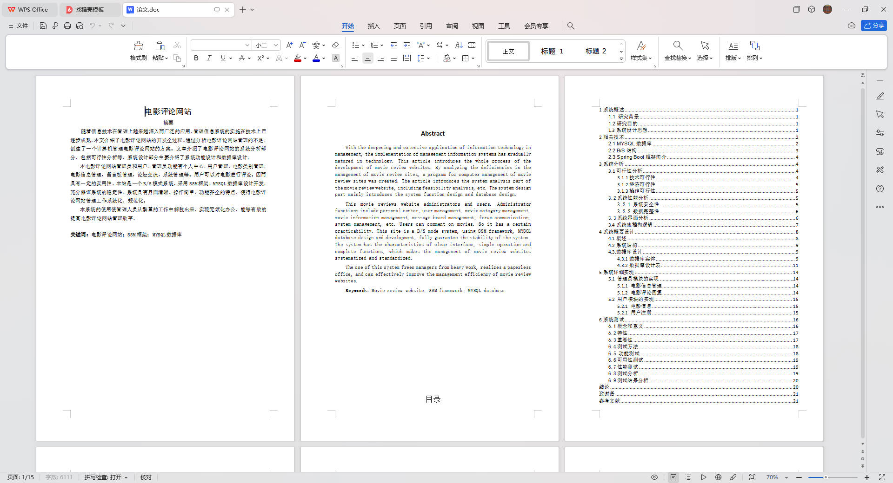

# 基于Springboot的电影评论网站系统

## Springboot-0075


## 技术栈

Springboot mybatisplus vue mysql maven


## 数据库表(11张)


## 功能介绍

```properties
管理员功能有个人中心，用户管理，电影类别管理，电影信息管理，留言板管理，论坛交流，系统管理等。

用户可以对电影进行评论,查看电影信息和视频.以及查看公告,进行留言反馈
```


## 图片

### 前台


### 后台


## 访问路径

### 前台

```properties
http://localhost:8080/springbootmts92/front/pages/login/login.html

账号 1
密码 1
```

### 后台

```properties
http://localhost:8080/springbootmts92/admin/dist/index.html#/login

账号 abo
密码 aboo
```


## 功能图


## 文档目录




## 打赏或交流


